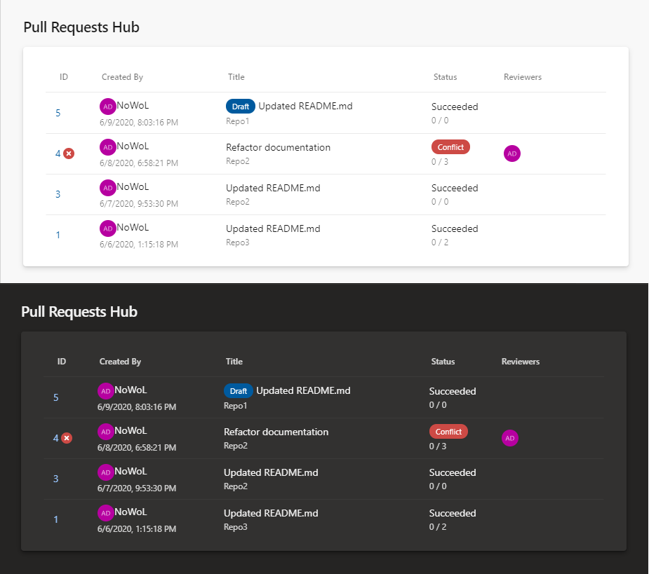

An Azure Devops extension to display every active pull requests of a project. This extension uses the `azure-devops-ui` package to use the same UI controls as Azure Devops to ensure a consistent UI experience (e.g.: darkmode).

As you can see from the screenshot below this extensions has the following features:

- It support darkmode
- The status column display the number of comments (resolved/total)
- Draft pull requests are identified
- Pull requests with conflict are clearly identified

